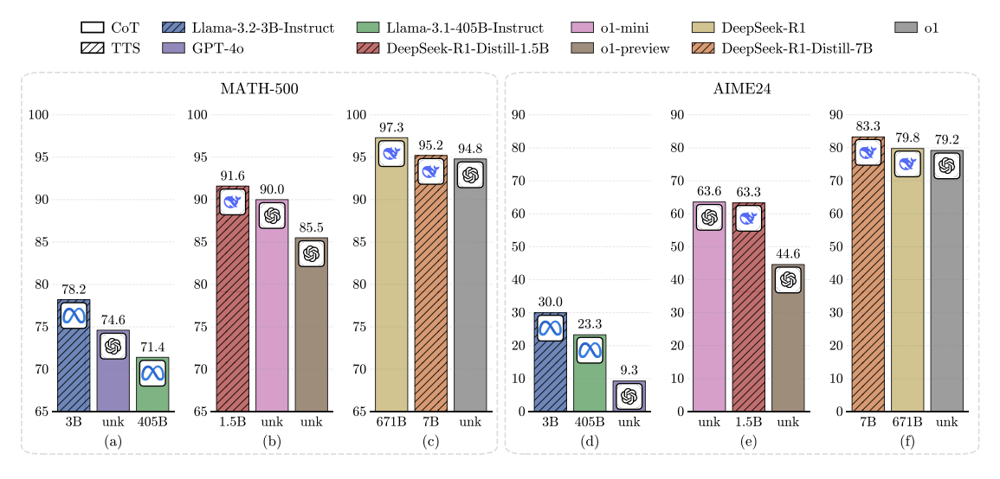
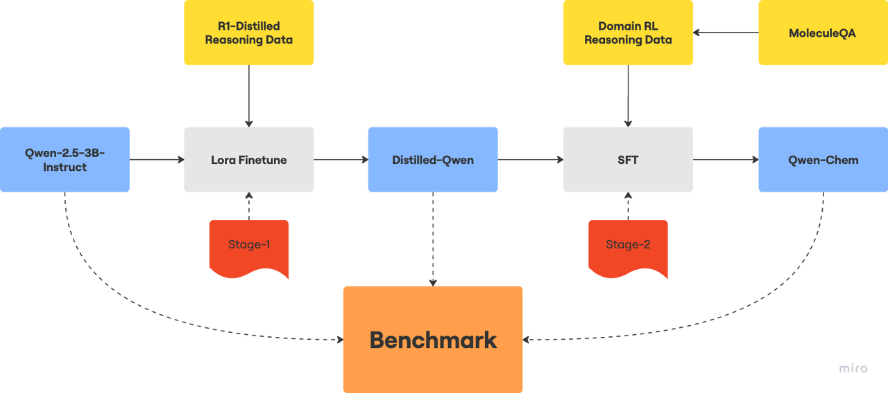
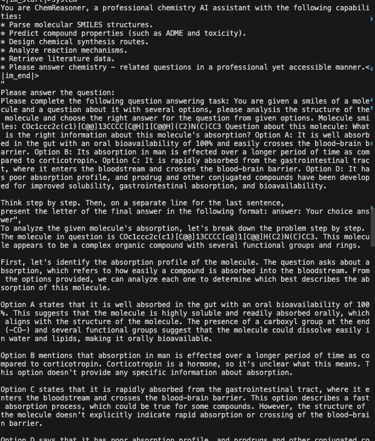
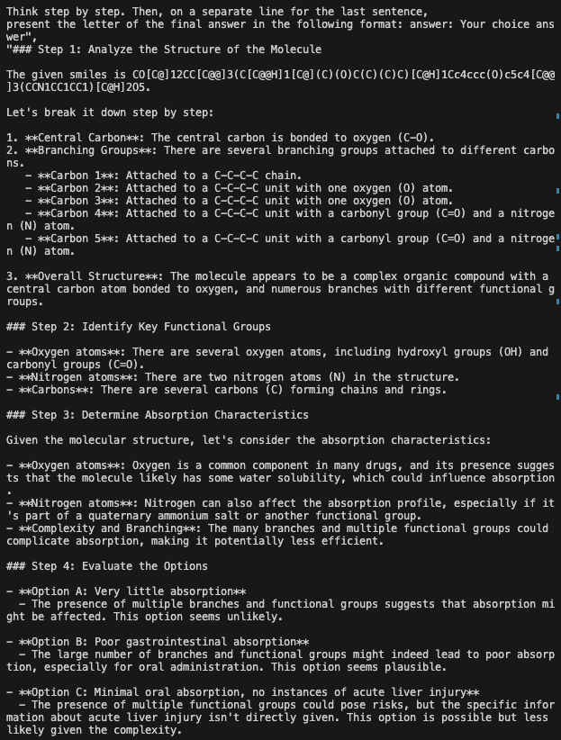
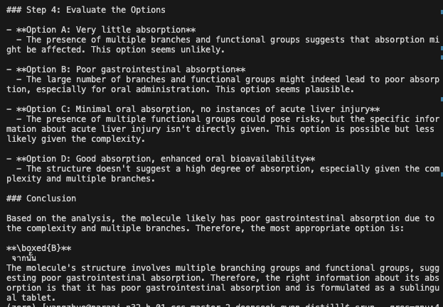
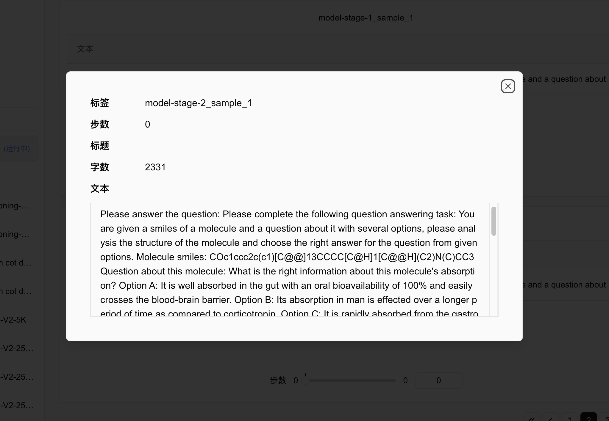
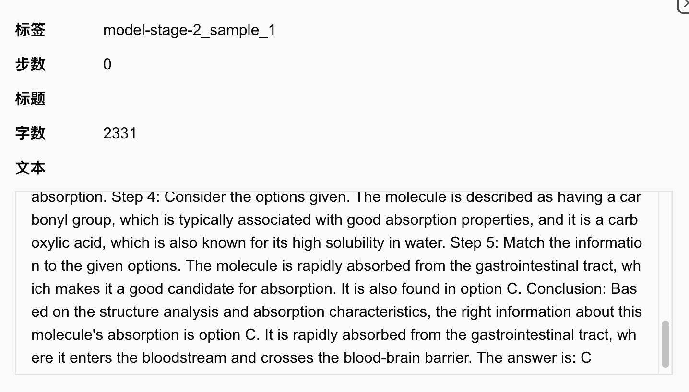
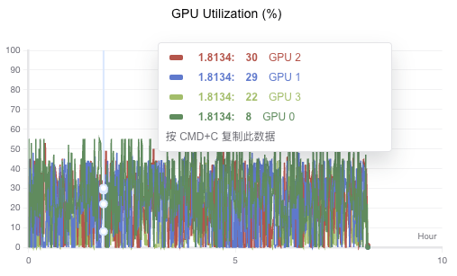
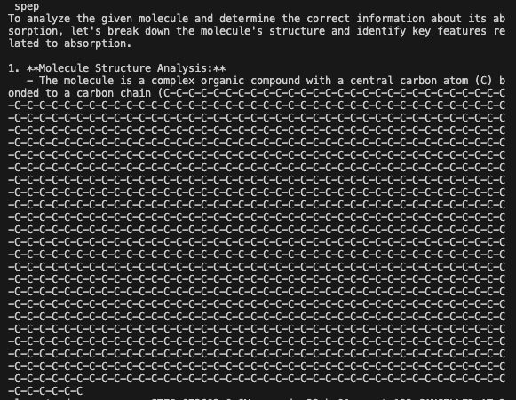
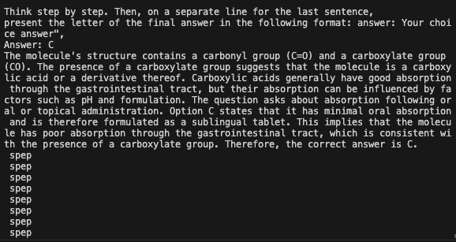

# [ChemReasoner]  技术报告

团队名称：「尖尖用来思考」

团队成员：杨卓、韩栋

联系方式：<yzachary1551@gmail.com>

## 1 摘要

随着 DeepSeek R1、O1 等推理模型的问世，强化学习（RL）技术在减轻模型幻觉、提升生成信息事实正确性方面的强大效能得以彰显。像 “Enhance RL context window” 和 “Test-time Scaling” 等技术成果，更是显著增强了大模型的性能。

然而，目前包括 R1 在内的众多蒸馏推理模型，大多借助数学逻辑推理语料进行训练，并在数学基准测试中进行评估。受 “Can 1B LLM Surpass 405B LLM? Rethinking Compute-Optimal Test-Time Scaling” 研究的启发，我们发现小模型通过对思维链（Chain of Thought，CoT）数据的蒸馏，在数学领域能够达到与超大规模 LLM 相媲美的表现。我们不禁思考，这种能力能否通过特定方式迁移到其他领域？这正是本研究想要探索的核心问题。

在本次研究中，我们以化学分子结构相关任务为切入点，尝试运用二次蒸馏或微调的方法，探究模型推理能力从数学领域迁移至其他领域下游任务的可行性，为拓展模型应用边界提供新的思路与实践依据。
我们工作的具体路线图如下：

## 2 方法

### 2.1 数据集选择

#### 2.1.1 数学能力蒸馏 CoT 数据

开源数据集 <https://huggingface.co/datasets/Magpie-Align/Magpie-Reasoning-V2-250K-CoT-Deepseek-R1-Llama-70B>
由 Magpie-Align 项目生成的 R1 蒸馏数据集，旨在推理数学问题，共 25000 条，我们挑选了 5000 条作为我们的训练数据

- 模态：文本形式。
- 格式：parquet。
- 语言：英语。
- ArXiv：arxiv:2406.08464。

#### 2.1.2 领域下游任务--化学分子结构式性质分析数据

由 MoleculeQA 经过 R1 蒸馏得到。MoleculeQA 的介绍如下

- 名称：MoleculeQA，即分子问答数据集，旨在评估分子理解中的事实准确性（A Dataset to Evaluate Factual Accuracy in Molecular Comprehension）。
- 发布时间：2024 年。
- 模态：文本。
- 语言：英语。
- 标签：化学、分子。
- 数据集结构：JSON 格式：包括 train.json（49,993 个）、valid.json（5,795 个）和 test.json（5,786 个）。

大语言模型在分子研究中的作用日益显著，但现有模型常生成错误信息，传统评估无法评估模型事实正确性。为解决此问题，作者构建了这个拥有 62K QA 对（涉及超过 23K 个分子）的新型问答数据集。每个 QA 对由人工问题、一个正确选项和三个错误选项组成，且与来自权威语料库的分子描述语义一致。它不仅是评估分子事实正确性的第一个基准，也是最大的分子问答数据集。对现有分子大语言模型在该数据集上的全面评估，揭示了它们在特定方面的不足，并指出了分子建模的关键因素。此外，还将其用于强化学习以减轻模型幻觉，提高生成信息的事实正确性。

### 2.2 模型选择及微调策略

我们采用了以下的蒸馏策略：

用 R1 生成的 CoT 数据进行知识蒸馏

我们采用了以下的微调策略：

- 模型选择：Qwen2.5-3b
- 微调技术：Lora，参数设置见下
peft_config = LoraConfig(
    r=8,  # Rank of the low-rank matrices
    lora_alpha=16,  # Scaling factor
    lora_dropout=0.2,  # Dropout rate
    target_modules=["q_proj", "k_proj", "v_proj", "o_proj"],  # Target attention layers
    bias="none",  # No bias terms
    task_type="CAUSAL_LM",  # Task type
)
- 使用框架：TRL，SwanLab，Flash-attention2，PEFT，Torch

## 3 实验结果

### 3.1 Benchmark 构建

由 MoleculeQA test 数据集上精心挑选的 100 个问题构成。MoleculeQA是第一个评估分子事实的问答数据集，其包含了4个不同方面的问题。我们按照原本数据集中的问题组成比例（结构：性质：应用 ：来源= 30：7：60：3），随机采样出100个问题，构成一个微型的benchmark，希望能够反应出模型在化学上的能力

### 3.2 基准测试

对于Qwen-2.5-3B-instruct，在100个问题上，正确回答了24个问题，正确率为24%，接近随机回答。而Deepseek-R1由于缺乏化学知识，无法处理一些专业表述（SMILES），正确率并不高。我们蒸馏后的模型虽然体量小，但也取得了不错的效果。

| 模型名称            | 准确率  |
|---------------------|---------|
| Qwen-2.5-3B-instruct | 24%    |
| Deepseek-R1         | 48.7%*  |

由于API不稳定，且 CoT 数据生成需要特别长的时间，benchmark 又特别难，这使得模型很容易就”短路“，于是没有完整测完所有benchmark

下面仅仅展示几个在 benchmark 推理成功的例子，详情可参考我们的[Benchmark-SwanLab 训练链接](https://swanlab.cn/@Harrison/deepseek-qwen-distllation/runs/zxrf7sxlmwpnpul6uu4l0/chart)：

3B 的模型展现出了超强的推理能力，最终成功推理出答案！！！

下面是 SwanLab 社区上的一个思考并回答正确的例子

# 4 总结

## 4.1 工作亮点

- 验证小体量模型（Qwen-2.5-3b）经过 CoT 数据蒸馏后，能否提升推理能力，虽然这已经被 compute-optimal-tts 这篇工作证实了。
- 探索小模型的 long CoT reasoning 的能力能否迁移：我们先是用 5000 条 R1 蒸馏的数学 CoT 数据对 Qwen2.5-3B 模型进行 SFT，企图让模型学会长的 reasoning能力，然后再用少量特定领域的下游任务 CoT 数据进行Lora 微调，尝试能否将 Long CoT推理能力迁移到下游任务。
  如果这被验证是可行的，那么除去推理时间的限制，很多下游任务都可以尝试通   过 scaling RL window 和 test time scaling的方式增强模型表现。这对于我们来说是意义深远的
- CoT 数据生成 Pipeline：我们依托于 hcaoaf/MoleculeQA 数据库。这是一个化学分子式的选择题 QA 库，我们使用 R1 来生成 CoT 数据，手动加入<think></think> tag

## 4.2 后续改进

在许多工程细节问题和代码规范上，「尖尖用来思考」队还有许多不足，感谢SwanLab 提供的看板，我们在使用 5000 条 CoT 数据做 SFT 时，很多时候 GPU 利用率都在50%以下，我们推断这可能与单机多卡时分布式训练策略有关。

未来可以使用 vllm ，deepspeed 等框架提升。
受限于时间限制，我们也意识到蒸馏得到的CoT 数据对于小 llm 是有作用的，未来将会考虑尝试 scaling up，不论是数学领域还是化学领域的 CoT 数据
以及 benchmark 的构建，对于 CoT 模型而言，完成推理需要特别长的 token消耗量，且检测不到模型回复过程中可能的错误，如复读，乱回答等，这些也恰好是小模型微调容易发生的问题，下面也展示两个 bad case（temparature 设置为 0.7 ）。

# 5 参考链接

- 魔搭社区代码仓库：<https://www.modelscope.cn/studios/yzachary/ChemReasoner/files>
- SwanLab 日志：<https://swanlab.cn/@Harrison/deepseek-qwen-distllation/overview>
- 开源模型权重：https://www.modelscope.cn/models/framehehe/distill-folder/files
- Demo 体验：暂无（模型文件太大了，还在上传，可参考本地 gradio 界面）

- Github 代码仓库: <https://github.com/little1d/deepseek-qwen-distill>  可能比魔搭社区代码仓库新
- report 链接：https://github.com/little1d/deepseek-qwen-distill/edit/main/doc/tech-report.md
